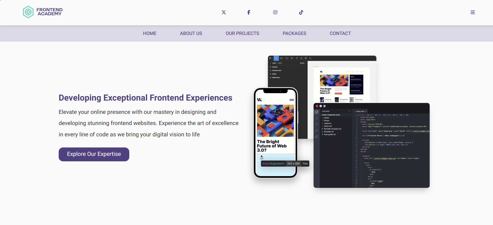
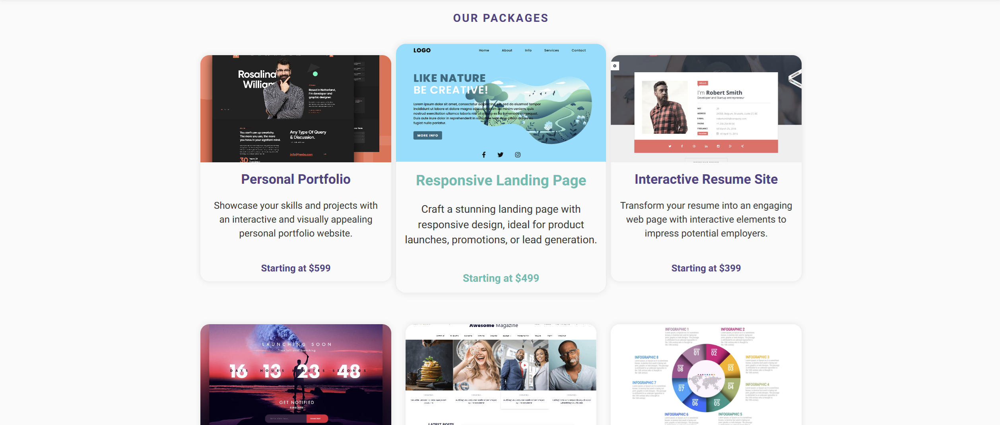

<div id="top"></div>


</br>


<div align="center">
  <h1 align="center">HTML/CSS Beginner Project</h1>
  <p>
    This is my very first HTML and CSS project, created as part of my journey into learning front-end development. </br> The project is a simple static webpage designed to practice and demonstrate basic web development skills.
  </p>
</div>




## Project Overview

  <p>This project was built using:</p>
<ul>
  <li><b>HTML5:</b> For structuring the content of the webpage.</li>
  <li><b>CSS3:</b> For styling the webpage and making it visually appealing.</li>
</ul>

</br>




</br>

## Features

<ul>
  <li>Semantic HTML structure</li>
  <li>Basic CSS styling, including:
    <ul>
      <li>Typography adjustments</li>
      <li>Layout using CSS properties like <code>flexbox</code> or <code>grid</code></li>
      <li>Colors and backgrounds</li>
      <li>Basic responsiveness for different screen sizes</li>
    </ul>  
  </li>
</ul>

</br>

## Purpose

  <p>This project serves as a starting point to:</p>
<ul>
  <li>Understand the fundamentals of HTML and CSS</li>
  <li>Practice creating a static webpage from scratch</li>
  <li>Explore CSS styling techniques</li>
</ul>

</br>

## Technologies Used

- **HTML** for the game structure.
- **CSS** for styling the game interface.
- **JavaScript** for game logic.

</br>


## How to View the Project

<p>To view the project locally:</p>

1. **Clone the repository**:
    ```bash
    git clone https://github.com/V3n0nX/firstproject.git
    ```

2. **Navigate to the project folder**:
    ```bash
    cd firstproject
    ```

4. **Open the `index.html` file in your web browser.**
